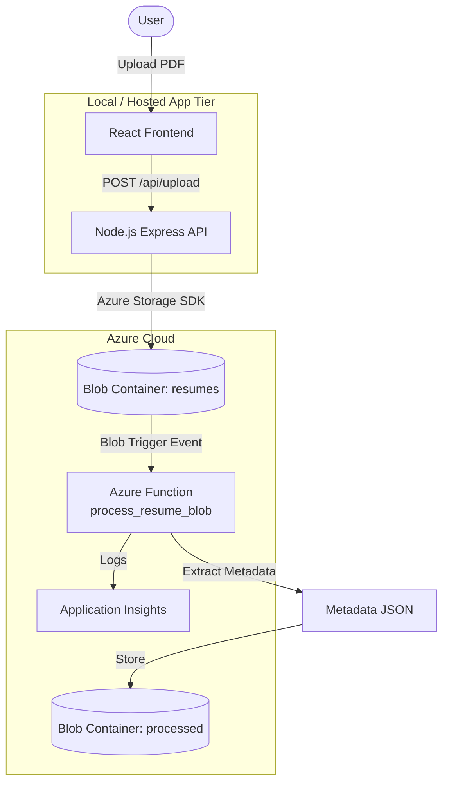

# Smart Resume Processing System

A cloud-native demo application showcasing **Azure Functions**, **Blob Storage**, **event-driven architecture**, and **Application Insights** monitoring.

Upload a PDF resume through a React frontend → store it in Azure Blob Storage → trigger a serverless Python function → extract metadata → save JSON to a processed container → log everything to Application Insights.

---

## Architecture



### Event Flow

1. **User** selects a PDF resume in the React app
2. **Frontend** sends the file to the Express API
3. **Backend** uploads the PDF to the `resumes` blob container
4. **Blob trigger** fires the Azure Function automatically
5. **Function** reads blob info (name, size, timestamp) and writes metadata JSON to `processed`
6. **Application Insights** captures function logs and telemetry

---

## Folder Structure

```
Resume-Processing/
├── frontend/                 # React + Vite UI
│   ├── src/
│   │   ├── components/       # FileUpload component
│   │   ├── App.jsx
│   │   └── main.jsx
│   └── package.json
├── backend/                  # Node.js Express API
│   ├── routes/upload.js      # Blob upload endpoint
│   ├── server.js
│   └── package.json
├── functions/                # Python Azure Function
│   ├── function_app.py       # Blob trigger handler
│   ├── host.json
│   └── requirements.txt
├── terraform/                # Infrastructure as Code
│   ├── main.tf
│   ├── variables.tf
│   ├── outputs.tf
│   └── modules/
│       ├── resource_group/
│       ├── storage/
│       ├── application_insights/
│       └── function_app/
├── docs/
│   └── ARCHITECTURE.md
├── docker-compose.yml        # Azurite for local blob storage
└── README.md
```

---

## Prerequisites

| Tool | Version | Purpose |
|------|---------|---------|
| Node.js | 18+ | Frontend & backend |
| Python | 3.11 | Azure Function |
| Azure Functions Core Tools | v4 | Run/deploy functions locally |
| Azure CLI | Latest | Azure login & deployment |
| Terraform | 1.5+ | Infrastructure provisioning |
| Docker | Latest | Local Azurite emulator (optional) |

---

## Local Development Setup

### 1. Start local blob storage (Azurite)

```bash
docker compose up -d
```

Default connection string for Azurite:

```
DefaultEndpointsProtocol=http;AccountName=devstoreaccount1;AccountKey=Eby8vdM02xNOcqFlqUwJPLlmEtlCDXJ1OUzFT50uSRZ6IFsuFq2UVErCz4I6tq/K1SZFPTOtr/KBHBeksoGMGw==;BlobEndpoint=http://127.0.0.1:10000/devstoreaccount1;
```

Create the containers (using Azure CLI with Azurite):

```bash
export AZURE_STORAGE_CONNECTION_STRING="DefaultEndpointsProtocol=http;AccountName=devstoreaccount1;AccountKey=Eby8vdM02xNOcqFlqUwJPLlmEtlCDXJ1OUzFT50uSRZ6IFsuFq2UVErCz4I6tq/K1SZFPTOtr/KBHBeksoGMGw==;BlobEndpoint=http://127.0.0.1:10000/devstoreaccount1;"

az storage container create --name resumes --connection-string "$AZURE_STORAGE_CONNECTION_STRING"
az storage container create --name processed --connection-string "$AZURE_STORAGE_CONNECTION_STRING"
```

### 2. Configure environment files

**Backend** — copy and edit:

```bash
cd backend
cp .env.example .env
# Set AZURE_STORAGE_CONNECTION_STRING to the Azurite string above
npm install
```

**Frontend**:

```bash
cd frontend
cp .env.example .env
npm install
```

**Functions**:

```bash
cd functions
cp local.settings.json.example local.settings.json
python -m venv .venv

# Windows
.venv\Scripts\activate
# macOS/Linux
source .venv/bin/activate

pip install -r requirements.txt
```

### 3. Run all services

Open three terminals:

```bash
# Terminal 1 — Backend API
cd backend && npm run dev

# Terminal 2 — Azure Function
cd functions && func start

# Terminal 3 — Frontend
cd frontend && npm run dev
```

Open **http://localhost:5173**, upload a PDF, and watch the function terminal for processing logs.

Verify metadata in the `processed` container:

```bash
az storage blob list --container-name processed --connection-string "$AZURE_STORAGE_CONNECTION_STRING" --output table
```

---

## Azure Deployment

### Step 1 — Provision infrastructure with Terraform

```bash
cd terraform
cp terraform.tfvars.example terraform.tfvars
# Edit terraform.tfvars if needed

terraform init
terraform plan
terraform apply
```

Save the outputs:

```bash
terraform output -json > ../deploy-outputs.json
terraform output storage_connection_string
terraform output function_app_name
```

Resources created:

- Resource Group
- Storage Account with `resumes` and `processed` containers
- Application Insights + Log Analytics Workspace
- Linux Function App (Consumption plan) with **System-Assigned Managed Identity**
- Role assignment: Function → Storage Blob Data Contributor

### Step 2 — Configure the backend

Create `backend/.env` with the Terraform output connection string:

```env
AZURE_STORAGE_CONNECTION_STRING=<from terraform output>
AZURE_STORAGE_CONTAINER=resumes
PORT=3001
```

Deploy the backend to your preferred host (Azure App Service, Container Apps, or run locally pointing to Azure storage for demos).

### Step 3 — Deploy the Azure Function

```bash
cd functions

# Login to Azure
az login

# Publish function code
func azure functionapp publish <function_app_name_from_terraform>
```

The blob trigger activates automatically once the function is deployed and connected to the storage account.

### Step 4 — Deploy the frontend

Build the production frontend:

```bash
cd frontend

# Set API URL to your deployed backend
echo "VITE_API_URL=https://your-backend-url" > .env.production

npm run build
```

Host the `dist/` folder on Azure Static Web Apps, Azure Blob Static Website, or any static host.

### Step 5 — Verify in Azure Portal

1. Upload a PDF via the frontend
2. Check **Storage Account → resumes** container for the uploaded file
3. Check **Storage Account → processed** container for the metadata JSON
4. Open **Application Insights → Logs** and run:

```kusto
traces
| where message contains "Blob trigger"
| order by timestamp desc
```

---

## API Reference

### `GET /api/health`

Health check endpoint.

### `POST /api/upload`

Upload a PDF resume.

| Field | Type | Description |
|-------|------|-------------|
| `resume` | File (multipart) | PDF file, max 10 MB |

**Response (201):**

```json
{
  "message": "Resume uploaded successfully",
  "blobName": "1717000000000-john_doe_resume.pdf",
  "container": "resumes",
  "size": 245760,
  "uploadedAt": "2026-05-31T12:00:00.000Z"
}
```

---

## Metadata JSON Schema

The Azure Function writes this structure to the `processed` container:

```json
{
  "fileName": "1717000000000-john_doe_resume.pdf",
  "fileSize": 245760,
  "fileSizeFormatted": "240.00 KB",
  "uploadTimestamp": "2026-05-31T12:00:01.123456+00:00",
  "sourceContainer": "resumes",
  "contentType": "application/pdf",
  "processedAt": "2026-05-31T12:00:02.456789+00:00",
  "status": "processed"
}
```

---

## Presentation Talking Points

| Concept | Where to Demo |
|---------|---------------|
| **Serverless Computing** | Azure Function — no servers to manage, scales automatically |
| **Event-Driven Architecture** | Blob upload triggers function without polling |
| **Azure Blob Storage** | Two containers: raw uploads vs. processed output |
| **Managed Identity** | Function App identity with RBAC to storage (no keys in code) |
| **Observability** | Application Insights traces for every processed resume |
| **Infrastructure as Code** | Terraform modules for repeatable deployments |

---

## Troubleshooting

| Issue | Solution |
|-------|----------|
| Function not triggering locally | Ensure Azurite is running and containers exist |
| `AzureWebJobsStorage` errors | Verify connection string in `local.settings.json` |
| Upload fails with 500 | Check backend `.env` connection string |
| CORS errors | Backend has CORS enabled; use Vite proxy in dev |
| Terraform name conflict | Storage account names must be globally unique — change `storage_account_prefix` |

---

## License

MIT — Free to use for educational demonstrations.
